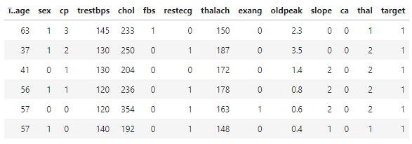
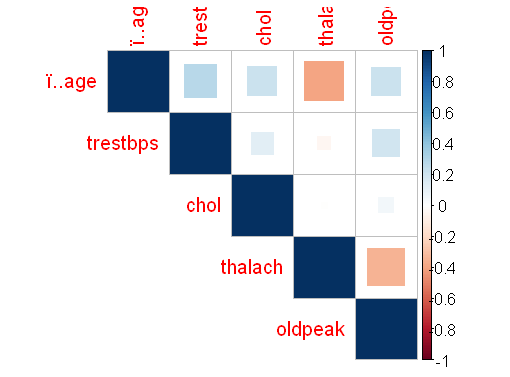

HEART DISEASE PREDICTION STATISTICS IS AS BELOW:

1) All columns of CSV:

2) Presence & Absense of Heart Disease:

3) Age Analysis by Age group:

4) Compare blood pressure across the chest pain by using BP & Sex:

5) Various symptoms using Cholesterol test:

6) Correlation between all symptoms with there columns:

__________*******____________*******__________********___________

